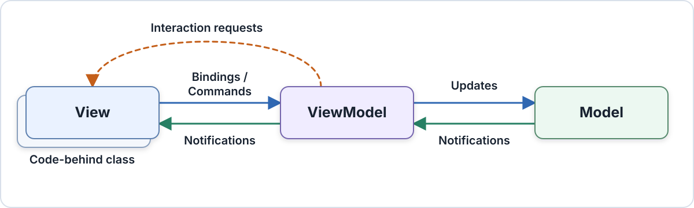
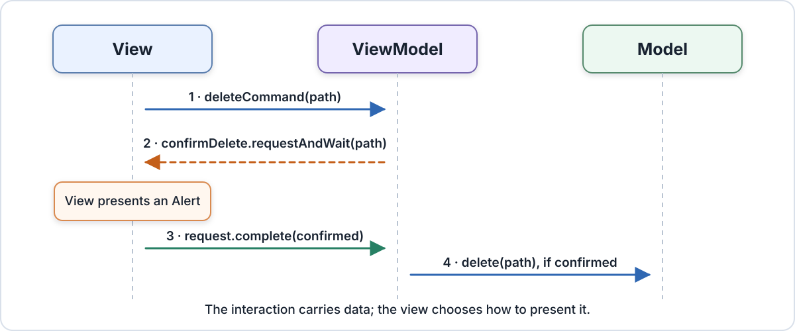

# Model-View-ViewModel pattern with FXML/2

Adopting the Model-View-ViewModel (MVVM) pattern organizes an application by clearly dividing the responsibilities of
handling data, displaying user interfaces, and managing user interactions. With MVVM, core logic and data models remain
independent of the visual layout and controls. This separation makes the user interface much easier to update and test,
and ensures that changes in appearance do not affect the overall application structure.

## The MVVM pattern

The following diagram shows how the view, view model, and model interact and exchange data in typical MVVM application:



The view knows about the view model it presents, and the view model knows about the model APIs it coordinates.
The model has no dependency on either presentation layer. Observable state flows from the view model to the view,
while bindings and commands carry user input in the other direction.

### View

The view owns structure, layout, styling, and behavior that is inherently visual. In a JavaFX application, it is
usually a compiled FXML/2 document with a small [code-behind class](../code-behind.html) that contains view-specific
code that cannot be expressed conveniently in markup. A view can represent a whole screen or a reusable portion of it.

Business rules and application logic do not belong in the view. For example, a code-behind class may start an
animation when an order is submitted, but the decision when that happens belongs to the view model.

### View model

The view model can be thought of as an abstract representation of the view; it exposes the state and operations that
a particular view needs, but it is not concerned with the actual JavaFX scene graph and its controls.
JavaFX properties and collections provide change notifications, commands represent user actions.

Some models may represent data in a way that cannot be easily consumed by a view. In these cases, the view model
also acts as an adapter that presents the data in a view-friendly way. This keeps view concerns out of the domain
API, and model concerns out of the JavaFX scene graph. View models should avoid references to controls such as `Button`
or `ListView`; that independence is what allows the presentation logic to run in a unit test without constructing a
scene graph.

### Model

The model encapsulates core business logic and data, enforces consistency, and serves as the source of truth.
It remains independent of JavaFX and presentation details, often exposing a domain-specific API and plain objects
instead of JavaFX properties.

## Example: build a sign-in dialog

{: .note }
The Command API used in this section is available in the [interactivity](https://github.com/jfxcore/interactivity) library.

The sign-in view needs four members from its view model:

- editable `username` and `password` properties
- read-only `statusMessage` property
- `signInCommand` whose availability follows the two input values

The model remains behind an application-specific service interface.

### Define the model service

```java
package com.example.login;

public interface AuthenticationService {
    boolean authenticate(String username, String password);
}
```

The interface says what the view model needs without prescribing where authentication happens. A production
implementation might call a remote endpoint; the example application will use a stub implementation.

### Create the view model

<details markdown="block">
<summary><code>com/example/login/LoginViewModel.java</code></summary>
```java
package com.example.login;

import javafx.beans.property.*;
import org.jfxcore.command.*;

public final class LoginViewModel {
    private final AuthenticationService authenticationService;
    private final StringProperty username = new SimpleStringProperty(this, "username");
    private final StringProperty password = new SimpleStringProperty(this, "password");
    private final ReadOnlyStringWrapper statusMessage = new ReadOnlyStringWrapper(this, "statusMessage");
    private final RelayCommand<Void> signInCommand = new RelayCommand<Void>(this::signIn);

    public LoginViewModel(AuthenticationService authenticationService) {
        this.authenticationService = authenticationService;

        signInCommand.executableProperty().bind(
            username.isNotEmpty().and(password.isNotEmpty()));
    }

    public StringProperty usernameProperty() {
        return username;
    }

    public StringProperty passwordProperty() {
        return password;
    }

    public ReadOnlyStringProperty statusMessageProperty() {
        return statusMessage.getReadOnlyProperty();
    }

    public Command signInCommand() {
        return signInCommand;
    }

    private void signIn() {
        if (authenticationService.authenticate(usernameProperty().get(), passwordProperty().get())) {
            statusMessage.set("Welcome!");
        } else {
            statusMessage.set("The username or password is incorrect.");
        }
    }
}
```
</details>

The public API describes ownership as well as type. The view may update the two editable properties, observe the
status message, and invoke the `signInCommand`. Importantly, the decision whether the command is executable is
authoritatively derived from view-model state, it is not implemented in the view.

### Create the view with FXML/2

<details markdown="block">
<summary><code>com/example/login/LoginView.fxml</code></summary>
```xml
<?xml version="1.0" encoding="UTF-8"?>
<?import javafx.scene.control.*?>
<?import javafx.scene.layout.VBox?>
<?import org.jfxcore.command.Command?>

<VBox xmlns="http://javafx.com/javafx" xmlns:fx="http://jfxcore.org/fxml/2.0"
      fx:subclass="com.example.login.LoginView"
      fx:context="$viewModel">

    <Label text="Username"/>
    <TextField text="#{username}" promptText="Username"/>

    <Label text="Password"/>
    <PasswordField text="#{password}" promptText="Password"/>

    <Button text="Sign in" defaultButton="true" Command.onAction="$signInCommand"/>
    <Label text="${statusMessage}"/>
</VBox>
```
</details>

[`fx:context`](../reference/context.html) makes `viewModel` the default evaluation context for expressions in the document.
The expression forms encode three different contracts:

| [Expression](../markup-extension/expression.html) | Meaning in this view |
|---|---|
| `#{username}` and `#{password}` | Synchronize editable control state with writable view-model properties. |
| `${statusMessage}` | Observe a value that is owned by the view model. |
| `$signInCommand` | Resolve the command object once, and connect it to the button. |

`Command.onAction` is the normal way to connect an `ActionEvent` to a parameterless command. It also follows the
command's `executable` state, so the button is disabled until both fields contain text.

### Connect view and view model

The view's [code-behind class](../code-behind.html) receives the view model before initializing the compiled scene graph:

<details markdown="block">
<summary><code>com/example/login/LoginView.java</code></summary>
```java
package com.example.login;

public final class LoginView extends LoginViewBase {
    final LoginViewModel viewModel;

    public LoginView(LoginViewModel viewModel) {
        this.viewModel = viewModel;
        initializeComponent();
    }
}
```
</details>

The assignment must come _before_ `initializeComponent()` because `fx:context="$viewModel"` is evaluated while the
component is initialized. Conversely, if the view needs to programmatically access the compiled scene graph, the code
must come _after_ `initializeComponent()`.

The application assembles the model, view model, and view at its composition root:

<details markdown="block">
<summary><code>com/example/App.java</code></summary>
```java
package com.example;

import com.example.login.AuthenticationService;
import com.example.login.LoginView;
import com.example.login.LoginViewModel;
import javafx.application.Application;
import javafx.scene.Scene;
import javafx.stage.Stage;

public final class App extends Application {
    @Override
    public void start(Stage stage) {
        AuthenticationService authenticationService =
            (username, password) -> "demo".equals(username) && "javafx".equals(password);

        var viewModel = new LoginViewModel(authenticationService);
        var view = new LoginView(viewModel);

        stage.setScene(new Scene(view));
        stage.setTitle("MVVM sign-in");
        stage.show();
    }
}
```
</details>

This example is **view-first, programmatic composition**: application code chooses `LoginView` and supplies the view
model that it presents.

## Choose a composition strategy

Two separate choices are often described as one:

1. **View-first or view-model-first:** which object does navigation select first?
2. **Programmatic or declarative construction:** where are the view and view model instantiated?

Declaratively creating a view model in FXML is still view-first composition, because constructing the view causes its
view model to be constructed.

| Strategy | Application selects | Good fit | Main cost |
|---|---|---|---|
| View-first, programmatic | A compiled view class | Most screens; constructor injection; explicit object graphs | Navigation code knows view types |
| View-first, declarative | An FXML view that creates its context | Self-contained views with a useful no-argument view model | Required services cannot be supplied naturally |
| View-model-first | A view model, then a view factory maps it to a view | Workflow-oriented navigation, replaceable presentations, navigation tests | A mapping and lifetime layer must be maintained |

### View-first composition

In view-first composition, a navigator or composition root constructs a view. The view may construct its view model,
but receiving it as a constructor dependency usually gives the application better control over services and lifetime:

```java
var viewModel = new LoginViewModel(authenticationService);
var view = new LoginView(viewModel);
```

This is usually the simplest choice in JavaFX because `Scene` and `Stage` ultimately display nodes, and compiled
FXML/2 views are regular Java classes. View-first does not introduce a dependency from the view model to the view; the
view model remains independently testable.

A view may instead instantiate a self-contained context in FXML:

```xml
<?import com.example.preferences.PreferencesViewModel?>
<?import javafx.scene.layout.VBox?>

<VBox xmlns="http://javafx.com/javafx" xmlns:fx="http://jfxcore.org/fxml/2.0">
    <fx:context>
        <PreferencesViewModel/>
    </fx:context>

    <!-- View content binds to PreferencesViewModel. -->
</VBox>
```

Use this form when a no-argument constructor represents a complete and valid view model. Do not add default production
dependencies merely to make a view model constructible from FXML; use programmatic composition when dependencies vary
between the application and tests.

### View-model-first composition

In view-model-first composition, navigation produces a view model and a factory selects the view that is used to
present the view model:

```java
package com.example.navigation;

import com.example.login.LoginView;
import com.example.login.LoginViewModel;
import javafx.scene.Parent;

public final class ViewFactory {
    public Parent create(Object viewModel) {
        if (viewModel instanceof LoginViewModel loginViewModel) {
            return new LoginView(loginViewModel);
        }

        throw new IllegalArgumentException(
            "No view registered for " + viewModel.getClass().getName());
    }
}
```

This approach is useful when navigation is expressed primarily in presentation state: for example, a workflow host
may switch among view models, tests may verify navigation without constructing controls, or the same view model may
have different desktop and embedded presentations.

The trade-off is infrastructure. The application must define view mappings, decide whether views and view models are
reused or recreated, and dispose view-owned subscriptions when a view is retired. FXML/2 deliberately does not define
a view locator or navigation service; compiled views can participate in either composition style.

## Shape the view-model contract for FXML/2

A view model does not need to make every member observable. It needs to expose each member in a form that matches how
the FXML view uses it. FXML/2 source paths can resolve a field, a plain no-argument method, a JavaBeans getter, or a
JavaFX property accessor.

| View-model contract | Typical FXML/2 use | Ownership |
|---|---|---|
| `StringProperty usernameProperty()` | `text="#{username}"` | The view and view model may both write. |
| `ReadOnlyStringProperty statusMessageProperty()` | `text="${statusMessage}"` | The view model writes; the view observes. |
| `Command signInCommand()` | `Command.onAction="$signInCommand"` | The view invokes a command defined by the view model. |
| `ObservableList<Account> accounts()` | `items="${..accounts}"` | The view observes collection content. |

Use a read-only property when the view should display state, but not modify the view model. Use a writable
`Property` when synchronization is part of the contract. Stable objects such as commands and interaction channels
can usually be resolved once with [`fx:Evaluate`](../reference/evaluate.html) rather than observed.

Derived presentation state should also remain in the view-model. In the sign-in example, command availability
is bound directly to the input properties:

```java
signInCommand.executableProperty().bind(username.isNotEmpty().and(password.isNotEmpty()));
```

The view does not need a second expression that repeats this rule. Purely visual formatting may remain in FXML through
[function expressions](../markup-extension/expression/function.html) or
[string conversion](../markup-extension/expression/conversion.html); a conversion with application meaning belongs in
the view model or a dedicated service.

## Use commands for user actions

A command represents a user action independently of the control or event that invokes it. The view model owns
the action and its availability; the view chooses how user input is translated into that action.

{: .note }
The Command API is available in the [interactivity](https://github.com/jfxcore/interactivity) library.

### Use `Command.onAction` for the common case

For a button, menu item, hyperlink, or another `ActionEvent` source, attach the command directly:

```xml
<Button text="Sign in" Command.onAction="$signInCommand"/>
```

The view model exposes the abstract `Command` type while keeping its implementation private:

```java
private final RelayCommand<Void> signInCommand = new RelayCommand<>(this::signIn);

public Command signInCommand() {
    return signInCommand;
}

private void signIn() {
    ...
}
```

`Command.onAction` is a shortcut for an `ActionEventTrigger` containing an `InvokeCommandAction`. The action disables
its associated node when the command is not executable and, for an asynchronous command, while it is executing.

### Use an explicit trigger when more configuration is needed

The expanded trigger/action form is useful when the command needs a parameter, is invoked by another event, receives
the event object, or changes the default disable behavior.

For example, a command can accept an account identifier:

```java
private final StringProperty selectedAccountId = new SimpleStringProperty(this, "selectedAccountId");
private final RelayCommand<String> selectAccountCommand = new RelayCommand<String>(selectedAccountId::set);

public Command selectAccountCommand() {
    return selectAccountCommand;
}
```

The view supplies the parameter while remaining independent of the operation's implementation:

```xml
<?import org.jfxcore.command.InvokeCommandAction?>
<?import org.jfxcore.interaction.ActionEventTrigger?>
<?import org.jfxcore.interaction.Interaction?>

<Button text="Use demo account">
    <Interaction.triggers>
        <ActionEventTrigger>
            <InvokeCommandAction command="$selectAccountCommand" parameter="demo"/>
        </ActionEventTrigger>
    </Interaction.triggers>
</Button>
```

Keyboard, mouse, and touch triggers use the same action. Those triggers remain view concerns because they describe a
particular input gesture; the command remains a view-model concern because it describes what the application should do.

## Request a user interaction from the view model

Commands carry intent from the view to the view model. An interaction request is the opposite of that: the view model
initiates an interaction because it needs a response that only the view can provide, such as a confirmation from the
user or a file selection:

| Requirement | MVVM mechanism |
|---|---|
| State remains visible and may change over time | Observable property or collection |
| The user asks the application to perform an action | Command |
| The view model needs a response before it can continue | Interaction |

Directly using `Alert`, `FileChooser`, or `Stage` from the view model would violate the separation of responsibilities
between the view and the view model. Instead, `Interaction<P, R>` defines a typed request contract: the view model
supplies payload `P`, and a subscribed view supplies response `R`.



The sequence is:

1. The view invokes a command with the selected file.
2. The view model requests confirmation through `Interaction<Path, Boolean>`.
3. The view presents an `Alert` and completes the request with the user's choice.
4. The view model calls the model operation only when the response is `true`.

### Define the interaction in the view model

For a modal confirmation, `requestAndWait` keeps the operation linear:

<details markdown="block">
<summary><code>com/example/files/FileViewModel.java</code></summary>
```java
package com.example.files;

import java.nio.file.Path;
import java.util.function.Consumer;
import org.jfxcore.command.Command;
import org.jfxcore.command.RelayCommand;
import org.jfxcore.interaction.Interaction;

public final class FileViewModel {
    private final Consumer<Path> deleteFile;
    private final Interaction<Path, Boolean> confirmDelete = new Interaction<>();
    private final RelayCommand<Path> deleteCommand = new RelayCommand<Path>(this::delete);

    public FileViewModel(Consumer<Path> deleteFile) {
        this.deleteFile = deleteFile;
    }

    public Interaction<Path, Boolean> confirmDeleteInteraction() {
        return confirmDelete;
    }

    public Command deleteCommand() {
        return deleteCommand;
    }

    private void delete(Path file) {
        Boolean response = confirmDelete.requestAndWait(file);
        if (response == Boolean.TRUE) {
            deleteFile.accept(file);
        }
    }
}
```
</details>

`Interaction<Path, Boolean>` is the request-response contract. The view model decides that confirmation is required;
the view decides whether that means an `Alert`, an in-place confirmation panel, or another presentation.

### Handle the request in the view

The code-behind subscribes after the compiled view has been initialized:

<details markdown="block">
<summary><code>com/example/files/FileView.java</code></summary>
```java
package com.example.files;

import java.nio.file.Path;
import javafx.scene.control.Alert;
import javafx.scene.control.ButtonType;
import javafx.util.Subscription;
import org.jfxcore.interaction.InteractionRequest;

public final class FileView extends FileViewBase {
    final FileViewModel viewModel;

    public FileView(FileViewModel viewModel) {
        this.viewModel = viewModel;
        initializeComponent();
        viewModel.confirmDeleteInteraction().subscribe(this::confirmDelete);
    }

    private boolean confirmDelete(InteractionRequest<Path, Boolean> request) {
        var alert = new Alert(Alert.AlertType.CONFIRMATION);
        alert.initOwner(getScene().getWindow());
        alert.setTitle("Delete file");
        alert.setHeaderText("Delete " + request.getPayload().getFileName() + "?");
        alert.setContentText("This action cannot be undone.");

        boolean confirmed = alert.showAndWait().orElse(ButtonType.CANCEL) == ButtonType.OK;
        request.complete(confirmed);
        return true;
    }
}
```
</details>

The listener returns `true` to accept responsibility for the request. Returning `false` passes it to the next listener,
which allows a view-local handler to coexist with an application-level fallback.

{: .note }
If the lifetime of the view and view model are decoupled, closing the view should also unsubscribe interaction
listeners, as otherwise the view will be kept alive by the view model. Alternatively, use weak listeners.

### Choose a request form and manage its lifetime

- Use `Interaction.requestAndWait(payload)` for a modal, sequential decision. On the JavaFX Application Thread it
  starts a nested event loop so that the user interface remains responsive while the view model waits for the response.
- Use `Interaction.request(payload)` when the view may complete the request later. It returns an `InteractionRequest`,
  which is a `CompletionStage<R>` and can be continued with `thenAccept`, `thenCompose`, etc.
- Every accepted request must be completed successfully, completed exceptionally, or cancelled. A request with no
  accepting listener throws `UnhandledInteractionException`.
- Keep the returned `Subscription` for exactly as long as the view is active, then unsubscribe. Otherwise the view model
  can retain a view that is no longer displayed.

A test can subscribe a listener that completes the request immediately, so the decision path can be tested without
constructing an `Alert` or a scene graph.

## Use background execution for long-running operations

In a real-world application, operations started by user actions often take a significant amount of time to complete.
For example, an authentication function may perform I/O like calling out to a web service. Since blocking the UI
thread until the operation completes is usually a bad user experience, applications should use background execution
for long-running operations:

<details markdown="block">
<summary><code>com/example/login/LoginViewModel.java</code></summary>
```java
package com.example.login;

import javafx.beans.property.*;
import org.jfxcore.command.*;

public final class LoginViewModel {
    private final AuthenticationService authenticationService;
    private final StringProperty username = new SimpleStringProperty(this, "username");
    private final StringProperty password = new SimpleStringProperty(this, "password");
    private final ReadOnlyStringWrapper statusMessage = new ReadOnlyStringWrapper(this, "statusMessage");
    private final ServiceCommand signInCommand;

    public LoginViewModel(AuthenticationService authenticationService) {
        this.authenticationService = authenticationService;
        this.signInCommand = createSignInCommand();

        signInCommand.executableProperty().bind(
            username.isNotEmpty().and(password.isNotEmpty()));
    }

    public StringProperty usernameProperty() {
        return username;
    }

    public StringProperty passwordProperty() {
        return password;
    }

    public ReadOnlyStringProperty statusMessageProperty() {
        return statusMessage.getReadOnlyProperty();
    }

    public Command signInCommand() {
        return signInCommand;
    }

    private ServiceCommand createSignInCommand() {
        Service<Boolean> service = new Service<>() {
            @Override
            protected Task<Boolean> createTask() {
                String currentUsername = usernameProperty().get();
                String currentPassword = passwordProperty().get();

                return new Task<>() {
                    @Override
                    protected Boolean call() {
                        return authenticationService.authenticate(currentUsername, currentPassword);
                    }
                };
            }
        };

        service.setOnRunning(event -> statusMessage.set("Signing in..."));

        service.setOnSucceeded(event -> statusMessage.set(
            service.getValue() ? "Welcome!" : "The username or password is incorrect."));

        return new ServiceCommand(
            service,
            exception -> statusMessage.set("Sign-in failed: " + exception.getMessage()));
    }
}
```
</details>

`ServiceCommand` is a `Command` implementation that uses a JavaFX `Service` to perform background work.
The public `signInCommand()` continues to return `Command`, so the FXML view does not need to change. Because
`ServiceCommand` is asynchronous, `Command.onAction` disables the button while the service is running by default.

## Test the view model without the view

View models can be tested through the same properties and commands used by FXML:

<details markdown="block">
<summary><code>com/example/login/LoginViewModelTest.java</code></summary>
```java
package com.example.login;

import org.junit.jupiter.api.Test;
import static org.junit.jupiter.api.Assertions.*;

class LoginViewModelTest {
    @Test
    void commandUsesCurrentInputAndPublishesTheResult() {
        AuthenticationService authentication =
            (username, password) -> username.equals("demo") && password.equals("javafx");

        var viewModel = new LoginViewModel(authentication);
        assertFalse(viewModel.signInCommand().isExecutable());

        viewModel.usernameProperty().set("demo");
        viewModel.passwordProperty().set("javafx");
        assertTrue(viewModel.signInCommand().isExecutable());

        viewModel.signInCommand().execute(null);
        assertEquals("Welcome!", viewModel.statusMessageProperty().get());
    }
}
```
</details>

This test covers presentation state, command availability, and model coordination without requiring the testing
environment to set up the actual JavaFX scene graph.
